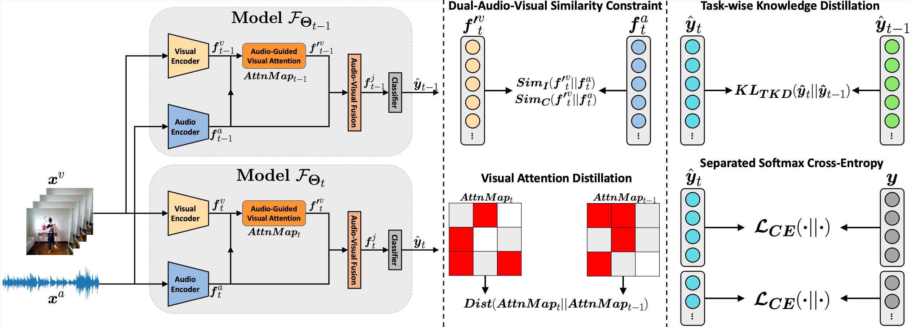

# Audio-Visual Class-Incremental Learning 

We introduce <b>audio-visual class-incremental learning</b>, a class-incremental learning scenario for audio-visual video recognition, and propose a method <b>AV-CIL</b>. [[paper](https://arxiv.org/pdf/2308.11073.pdf)]

<div align="center">
  
</div>


## Environment

We conduct experiments with Python 3.8.13 and Pytorch 1.13.0.

To setup the environment, please simply run

```
pip install -r requirements.txt
```

## Datasets

### AVE

The original AVE dataset can be downloaded through [link](https://drive.google.com/open?id=1FjKwe79e0u96vdjIVwfRQ1V6SoDHe7kK).

Please put the downloaded AVE videos in [./raw_data/AVE/videos/](./raw_data/AVE/videos/).


### Kinetics-Sounds

The original Kinetics dataset can be downloaded through [link](https://github.com/cvdfoundation/kinetics-dataset). After downloading the Kinetics dataset, please apply our provided video id list ([here](./data/kinetics-sounds/)) to extract the Kinetics-Sounds dataset used in our experiments. 

Please put the downloaded videos in [./raw_data/kinetics-sounds/videos/](./raw_data/kinetics-sounds/videos/).


### VGGSound100

The original VGGSound dataset can be downloaded through [link](https://www.robots.ox.ac.uk/~vgg/data/vggsound/). After downloading the VGGSound dataset, please apply our provided video id list ([here](./data/VGGSound_100/)) to extract the Kinetics-Sounds dataset used in our experiments.

Please put the downloaded videos in [./raw_data/VGGSound/videos/](./raw_data/VGGSound/videos/).


### Extract audio and frames

After downloading the datasets to the folds, please run the following command to extract the audios and frames

```
sh extract_audios_frames.sh 'dataset'
```
where the 'dataset' should be in [AVE, ksounds, VGGSound_100].


## Pre-trained models
For the audio encoder, please download the pre-trained [AudioMAE](https://drive.google.com/file/d/1ni_DV4dRf7GxM8k-Eirx71WP9Gg89wwu/view?usp=share_link) and put it in [./model/pretrained/](./model/pretrained/). 


## Feature extraction

For the pre-trained audio features extraction, please run

```
sh extract_pretrained_features 'dataset'
```
where the 'dataset' should be in [AVE, ksounds, VGGSound_100].

For the running environment of the AudioMAE, we follow the official implementation and use **timm==0.3.2**, for which a [fix](https://github.com/rwightman/pytorch-image-models/issues/420#issuecomment-776459842) is needed to work with Pytorch 1.8.1+.


## (option) Use our extracted features directly

We also released the pre-trained features, you can use them directly instead of pre-processing and extracting them from the raw data: [AVE](https://huggingface.co/datasets/wiberg/AV-CIL_features/resolve/main/AVE_features.zip), Kinetics-Sounds [[part-1](https://huggingface.co/datasets/wiberg/AV-CIL_features/resolve/main/KS_features.zip.aa), [part-2](https://huggingface.co/datasets/wiberg/AV-CIL_features/resolve/main/KS_features.zip.ab), [part-3](https://huggingface.co/datasets/wiberg/AV-CIL_features/resolve/main/KS_features.zip.ac)], VGGSound100[[part-1](https://huggingface.co/datasets/wiberg/AV-CIL_features/resolve/main/VS100_features.zip.aa), [part-2](https://huggingface.co/datasets/wiberg/AV-CIL_features/resolve/main/VS100_features.zip.ab), [part-3](https://huggingface.co/datasets/wiberg/AV-CIL_features/resolve/main/VS100_features.zip.ac), [part-4](https://huggingface.co/datasets/wiberg/AV-CIL_features/resolve/main/VS100_features.zip.ad), [part-5](https://huggingface.co/datasets/wiberg/AV-CIL_features/resolve/main/VS100_features.zip.ae), [part-6](https://huggingface.co/datasets/wiberg/AV-CIL_features/resolve/main/VS100_features.zip.af)].

**For Kinetics-Sounds and VGGSound100, please download all the parts and concatenate them before unzipping.**

After obtaining the pre-trained audio and visual features, please put them to ./data/'dataset'/audio_pretrained_feature/ and ./data/'dataset'/visual_pretrained_feature/.

## Training & Evaluation

For vanilla fine-tuning strategy, please run

```
sh run_incremental_fine_tuning.sh 'dataset' 'modality'
```
where the 'dataset' should be in [AVE, ksounds, VGGSound_100], and the 'modality' should be in [audio, visual, audio-visual].


For the upper bound, please run

```
sh run_incremental_upper_bound.sh 'dataset' 'modality'
```


For LwF, please run

```
sh run_incremental_lwf.sh 'dataset' 'modality'
```


For iCaRL, please run

```
sh run_incremental_lwf.sh 'dataset' 'modality' 'classifier'
```
where the 'classifier' should be in [NME, FC].


For SS-IL, please run

```
sh run_incremental_ssil.sh 'dataset' 'modality'
```


For AFC, please run

```
sh run_incremental_afc.sh 'dataset' 'modality' 'classifier'
```
where the 'classifier' should be in [NME, LSC].


For our AV-CIL, please run

```
sh run_incremental_ours.sh 'dataset'
```


## Citation

If you find this work useful, please consider citing it.
```
@inproceedings{pian2023audiovisual,
  title={Audio-Visual Class-Incremental Learning},
  author={Pian, Weiguo and Mo, Shentong and Guo, Yunhui and Tian, Yapeng},
  booktitle={IEEE/CVF International Conference on Computer Vision},
  year={2023}
}
```